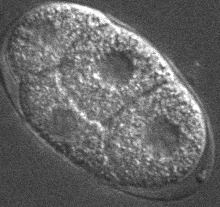
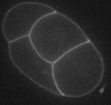

# Introduction

In this lab, you'll get a chance to use image analysis techniques to approach
a real-world problem: segmentation of a biological image. "Segmentation"
refers to the process of identifying relevant features within the image.

Our images come from Dr. Walston's work with _Caenorhabditis elegans_, a
non-parasitic roundworm whose characteristics make it a good model organism
for scientific study. In one research project, we investigated the four-cell
stage of development of the _C. elegans_ embryo, and to do that we needed to
segment many images in order to identify cell positions and other features.

For this project, you'll try to accomplish three goals:

- create a binary (0/1) image that marks the four cell nuclei,
- create a binary image that marks the cell walls of the four cells, and
- create a binary image that marks the egg shell (this one is the optional
  bonus round if you finish the other two).

The two images you have to work with are shown below:

<table>
<tr><td>
**Differential Interference<br /> Contrast (DIC)**
</td>
<td>
**Green Fluorescent Protein (GFP)**
</td></tr>
<tr><td>

</td>
<td>

</td></tr>
</table>

Cell nuclei can be identified as the "flat" gray ares in the DIC image. The
egg shell is also visible as the oval shape surrounding the cells. Cell walls
fluoresce in the GFP image.

# Your Tools

There are at least three well-used packages for image analysis in R.

**`EBImage`**

Available from _Bioconductor_. General-purpose image analysis, with an
eye toward microscopy and biological applications.

**`imager`**

A prackage for image processing. Perhaps a greater emphasis on
_processing_ over _analysis_, although it does some of both.

**`magick`**

Package providing an interface with the ImageMagick library, a well-known
open-source image manipulation library. Perhaps greatest variety of image
manipulation commands, but less emphasis on scientific analysis.

We'll primarily use the `imager` package, simply because it allows us to
bypass installing packages from Bioconductor (not that that's a bad thing!).

```{r message=FALSE}
#install.packages("imager")
library(tidyverse)
library(imager)
library(manipulate)
```

You can find lots of good information about `imager` from it's CRAN web site.
The introductory material is located here:

[https://cran.r-project.org/web/packages/imager/vignettes/gettingstarted.html](https://cran.r-project.org/web/packages/imager/vignettes/gettingstarted.html)

## Loading and Displaying Images

```{r}
dic <- load.image("egg_dic.png")
gfp <- load.image("egg_gfp.png")
plot(dic)
plot(gfp)
```

## Transformations and Filters

### Rescaling Images

Sometimes, when applying certain transforms, your image values will go outside
the range from 0 to 1. The `plot` command will (by default) rescale the
displayed image ot make sure its values stay between 0 and 1. However, if you
have the need to rescale the image itself, you can use the `renorm` command to
rescale the image however you like, for example:

`renorm(img, min=0, max=1)`

### Gaussian Blur

```{r}
isoblur(dic, sigma=2) %>% plot()
isoblur(dic, sigma=20) %>% plot()
```

### Edge Detection

Edge detection can be done in steps by first calculating the discrete
partial "derivative" in the x direction and then in the y direction. Using
those to calculate the length of the gradient vector at each point gives
something equivalent to what we did in class.

```{r}
dic.dx <- imgradient(dic, "x")
dic.dy <- imgradient(dic, "y")
dic.grad <- sqrt(dic.dx^2 + dic.dy^2)
plot(dic.dx)
plot(dic.dy)
plot(dic.grad)
```

### Thresholding

You can do thresholding the "old-fashioned" way with a logical comparison
(note that pixel intensities are treated as being from 0 to 1):

```{r}
# TRUE is white. This 0.40 is 40% of the maximum intensity.
plot(gfp >= 0.40)
```

Or, likely better, you can use the `threshold` command, which takes a numeric
`thr` value, a string representing a quantile, or the string "auto".

```{r}
# This 40% refers to the 40th percentile of intensities _in the image_.
threshold(gfp, thr="40%") %>% plot()
```

### Erode and Dilate Operations

To use `erode` and `dilate` functions, we first need to define a "structuring
element". Variations on the `erode` and `dilate` functions (look them up!)
allow you to specify a square or rectangular structuring element, but let's
specify our own.

```{r fig.width=8, fig.height=4}
par(mfcol=c(1, 2))
M <- matrix(c(0, 1, 0,
              1, 1, 1,
              0, 1, 0), ncol=3)
# The `as.cimg` command changes a plain matrix into the type of object imager
# uses.
M <- as.cimg(M)
gfp.thresh <- threshold(gfp, 0.25)
gfp.erode <- erode(gfp.thresh, mask=M)
plot(gfp.thresh)
plot(gfp.erode)
```

### Background Equalization

Here's an example of the blur and division method we discussed last time in
class:

```{r}
plot(gfp)
(gfp / isoblur(gfp, sigma=20)) %>% plot()
```

### How do you "skeletonize" an image?

If you'd like to reduce an image down to a single-pixel width without making
it disappear entirely, you could erode it until "just before" it disappears.
But how do you know when that is? Here's the train of thought:

- An "opening" operation first erodes, then dilates an image. 
- "Thick" regions are preserved under an opening operation.
- Single-pixel regions disappear under an opening operation.
- The regions we want to keep are the regions that disappear under an opening.

```{r fig.width=16, fig.height=16}
par(mfrow=c(4,4))
test.im = as.cimg(t(matrix(c(1, 1, 0, 1, 0, 0, 1, 0, 0, 0,
                             1, 1, 0, 1, 0, 0, 1, 0, 0, 0,
                             1, 1, 0, 1, 0, 0, 1, 0, 0, 0,
                             0, 1, 0, 1, 0, 0, 1, 0, 1, 1,
                             0, 1, 0, 1, 0, 0, 0, 1, 1, 1,
                             0, 1, 1, 1, 0, 0, 1, 1, 1, 1,
                             0, 1, 1, 1, 0, 0, 1, 1, 1, 1),
                           byrow=TRUE, ncol=10)))
plot(test.im, main="Stage 1: Original", interpolate=FALSE)
plot(erode(test.im, mask=M), main="Eroded", interpolate=FALSE)
plot(mopening(test.im, mask=M), main="Opened", interpolate=FALSE)
skel <- test.im & !mopening(test.im, mask=M)
plot(skel, main="Skel = Image Px not in Opened", interpolate=FALSE)
next.im <- erode(test.im, M)
plot(next.im, main="Stage 2: Eroded Original", interpolate=FALSE)
plot(erode(next.im, mask=M), main="Eroded", interpolate=FALSE)
plot(mopening(next.im, mask=M), main="Opened", interpolate=FALSE)
skel <- skel + next.im & !mopening(next.im, mask=M)
plot(skel, main="Skel = Skel + Image Px not in Opened", interpolate=FALSE)
next.im <- erode(next.im, M)
plot(next.im, main="Stage 3: Eroded Original", interpolate=FALSE)
plot(erode(next.im, mask=M), main="Eroded", interpolate=FALSE)
plot(mopening(next.im, mask=M), main="Opened", interpolate=FALSE)
skel <- skel + next.im & !mopening(next.im, mask=M)
plot(skel, main="Skel = Skel + Image Px not in Opened", interpolate=FALSE)
next.im <- erode(next.im, M)
plot(next.im, main="Stage 3: Eroded Original", interpolate=FALSE)
plot(erode(next.im, mask=M), main="Eroded", interpolate=FALSE)
plot(mopening(next.im, mask=M), main="Opened", interpolate=FALSE)
skel <- skel + next.im & !mopening(next.im, mask=M)
plot(skel, main="Skel = Skel + Image Px not in Opened", interpolate=FALSE)
```

We can write a short function to skeletonize. Although I knew this as recently
as 2009, I reminded myself from this web site:

[http://felix.abecassis.me/2011/09/opencv-morphological-skeleton/](http://felix.abecassis.me/2011/09/opencv-morphological-skeleton/)

```{r}
skeletonize <- function(img, M) {
  skel <- img * 0			# Skeleton starts empty.
  while(any(img==1)) {
    skel <- skel | (img & !mopening(img, M))
    img <- shrink(img, M)
    }
  skel
  }
plot(skeletonize(test.im, M), interpolate=FALSE)
```

This algorithm isn't perfect (it's not guaranteed to produce connected
skeletons). There are other, better ones that take more code
to implement. The `mmand` package seems to do this, but at the cost of another
set of interfaces. "Medial Axis" transforms and "Hit-and-miss" algorithms are
other choices.

# Putting it Together

## Cell Nuclei

To find the nuclei, we want to find regions of low variability--they look like
flat, unmarked disks on the image.

- **Step 1:** Do a transform to transform variability into brightness.
  Edge detection works here.
  
- **Step 2:** We want large areas of low or high brightness, so blur can get
  rid of unnecessary detail.
  
- **Step 3:** Once variability is identified as brightness, threshold can find
  the areas we want.

```{r}
plot(dic)
dic.edge <- sqrt(imgradient(dic, axes="x")^2 + imgradient(dic.eq, axes="y")^2)
plot(dic.edge)
manipulate(plot(isoblur(dic.edge, sigma=s)), s=slider(0, 20))
dic.edge.blur <- isoblur(dic.edge, sigma=5)
manipulate(plot(threshold(dic.edge.blur, thr=as.character(th))),
                th=slider(0, 100))
dic.edge.blur.thr <- threshold(dic.edge.blur, thr="44")
```

## Cell Walls

- **Step 1:** The GFP already identifies cell walls with brightness, but it's
  "noisy." So, blur to remove noise.
  
- **Step 2:** The image is not at constant brightness, so equalize.

- **Step 3:** Now the information we want is encoded as brightness, so 
  threshold will bring it out.

- **Step 4:** Skeletonize?

```{r}
plot(gfp)
manipulate(plot(isoblur(gfp, sigma=s)), s=slider(0, 20))
gfp.blur <- isoblur(gfp, sigma=3)
gfp.blur.eq <- gfp.blur/isoblur(gfp.blur, sigma=20)
plot(gfp.blur.eq)
manipulate(plot(threshold(gfp.blur.eq, thr=as.character(th))), th=slider(0, 100))
gfp.blur.eq.thr <- threshold(gfp.blur.eq, thr="80%")
gfp.skel <- skeletonize(gfp.blur.eq.thr, M)
plot(gfp.skel)
```


# Connected Components and Pixsets

First, we'll make labels for the nuclei. The `imager` package has a command
called `label` that numbers each connected component.

```{r}
dic.label <- label(dic.edge.blur.thr)
plot(dic.label)
unique(dic.label)
dic.nuc <- dic.label
# Final image gets rid of components that are too small or too big.
for(l in unique(dic.label)){
  if(sum(dic.label==l) < 200){dic.nuc[dic.label==l] <- 0}
  else if(sum(dic.label==l) > 2000) {dic.nuc[dic.label==l] <- 0}
  else {dic.nuc[dic.label==l] <- 1}
}
plot(dic.nuc)
```

Now, for cell walls, we want the largest connected component. I'll do something
fancier here, just to demonstrate, although we could have used the last
approach just fine.

```{r}
# The split_connected command makes a list of images, one for each (white)
# component.
gfp.labels <- split_connected(gfp.blur.eq.thr)
# A list of sizes for each whilte component.
gfp.sizes <- map_int(gfp.labels, sum)
gfp.walls <- gfp.labels[[which.max(gfp.sizes)]]
plot(gfp.walls)
```

# Further Processing

Suppose we want thin cell walls. Skeletonization is an option. See some of the 
other packages mentioned above.

Anotion option might be to create a "distance map" and then, perhaps use what's
called a "watershed" algorithm. A distance map replaced pixels in an image
with their distance from pixels of a specified color. 

```{r}
# How far is the pixel from the closest black pixel?
gfp.dist <- distance_transform(gfp.walls, value=0)
plot(gfp.dist)
```

The distance map looks a little like a mountain range. The watershed algorithm
asks "If we started with a set of water sources and flooded the regions of the
map, where would the flooded regions meet each other." This will generally
find the highest points on the "ridges."

Although this is always the general description that is given, note that
this particular watershed function actually needs a reversed map.

```{r}
# First element gives a set of region labels. Non-zero labels will grow.
# Second element is a list of priorities. Higher means regions grow
# faster through them. [Note opposite of most watershed functions, where
# higher values _stop_ regions.]
dic.lab <- label(dic.nuc)   # Get individual labels for nuclei again.
ws <- watershed(dic.lab, max(gfp.dist)- gfp.dist)
table(ws)
plot(ws)
# Oops! Need a label for outside region, or it will be filled by a cell!
dic.lab[2,2] <- 5
ws <- watershed(dic.lab, max(gfp.dist)- gfp.dist)
table(ws)
plot(ws)
```

Now, if we want to, we can edge-detect this image.

```{r}
sqrt(imgradient(ws, axes="x")^2 + imgradient(ws, axes="y")^2) %>%
  threshold(thr=.1) %>% plot()
```

